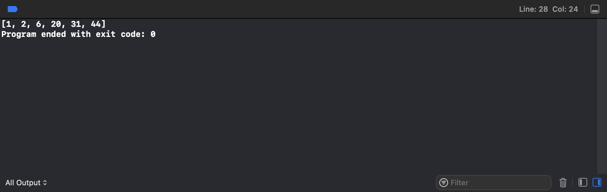
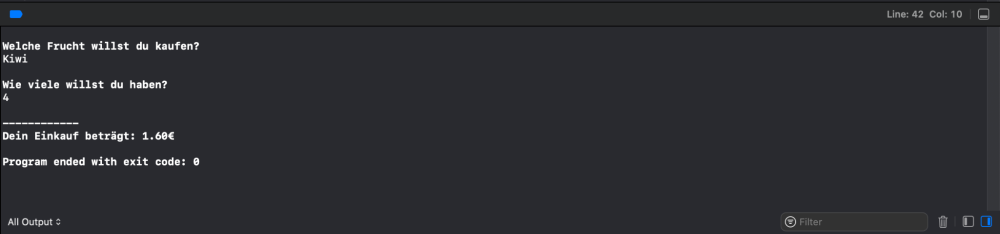

[](https://classroom.github.com/a/cfAdFBr8)
# Aufgabe_Swift_1.5 (Praxisfreitag)

Hinweis: Die folgenden Aufgaben sollen als Konsolen-Projekte erstellt werden

## 1. Lottozahlen-Simulator

**1.1 Schreibe einen Lottozahlen-Simulator. Achte dabei auf folgendes:**

- Gezogen werden pro Durchlauf sechs Zahlen. Diese sollen in der Konsole ausgegeben
werden (sortiert).
- Es können nur Zahlen von 1 – 49 gezogen werden.
- Die gezogenen Zahlen können im selben Durchlauf nur ein einziges Mal gezogen werden.
- Die Zahlen werden rein zufällig gezogen.
- Führe das Programm aus um die 6 Zahlen in der Konsole zu sehen
- Deine Ausgabe sollte ungefähr so aussehen



## Tipps: 
- benutze random(in:)
- Ranges in Swift schreibt man mit “...” 

## Bonus:
- lasse zuerst den Nutzer 6 Zahlen eingeben
- gib einen Gewinn aus, je nach Anzahl der richtig geratenen Zahlen


## 2. Praxis: Früchte-Shop

**2.1 Erstelle einen Früchteshop als Konsolen-Programm**




## Aufgabe:
- erstelle ein Sortiment an Früchten
- gib jeder Frucht einen Preis
- (präsentiere dein Angebot an den Kunden via Konsolenausgabe)
- frage den Nutzer welche Frucht er kaufen will via Konsoleneingabe, und wieviele davon
- berechne den Preis des Einkaufs

## Tipps: 
- ein Dictionary oder ein Enum ist super geeignet zum Speichern der Preise
- Vorsicht mit Optionals!
- ```dict[obst]``` gibt einen Double? zurück
- ```readLine()`` gibt einen String? zurück

## Bonus: 
- Kunde bezahlt mit Betrag -> Wechselgeld ausrechnen
- erlaube dem Kunden mehrere Produkte zu kaufen -> erstelle einen Kassenbon

